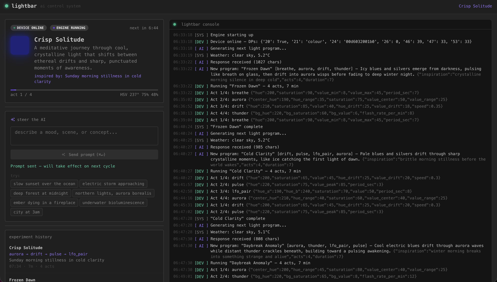

# lightbar

An AI-controlled RGB gaming lightbar. Claude Haiku generates evolving light programs — themes, moods, patterns — and a Python engine executes them in real time at 10 Hz directly to the hardware. You can steer it by typing prompts in a small web UI.

This is not a product. It has no real use case. It exists because it was fun to build, and because building it taught more about agentic AI coding in a few hours than weeks of reading about it could.

The key insight: just as Claude Code closes the UI design loop by letting the agent open a browser and see what it built, pointing a webcam at the lightbar gave the agent eyes on the physical world it was controlling — turning a blind code-and-hope process into a genuine observe-correct-iterate loop with real hardware.

---



---

## What it does

- **Claude Haiku** generates a "light program" every ~7 minutes: a theme, a description, and a sequence of acts (e.g. `thunder → aurora → breathe → drift`)
- Each act specifies a named pattern and its parameters. Python computes the HSV color at 10 Hz and sends it to the device over the local network via Tuya v3.5
- The AI uses real context: current time, day of week, and live weather from Open-Meteo
- You can interrupt and redirect it mid-program by typing a prompt ("make it feel like a thunderstorm" / "slow warm ember")
- A web UI shows what's running, the live HSV readout, a progress bar, and a scrolling console of all AI and device events

---

## Stack

| Layer | Tech |
|---|---|
| Device | Battletron Gaming Light Bar, Tuya v3.5, LAN control |
| Protocol | tinytuya — direct TCP to port 6668, no cloud |
| Backend | Python / FastAPI + asyncio, SSE for live updates |
| AI | Anthropic Claude Haiku (`claude-haiku-4-5-20251001`) |
| Frontend | React 18 + Vite + Mantine v7 dark theme |
| Build | Single Docker image (multi-stage: Node build → Python runtime) |

---

## Setup

### 1. Get a Tuya device

Any Tuya-compatible RGB bulb or light strip will work if it supports colour mode (DP 24). Set it up in the **Smart Life** or **Tuya Smart** app first.

**Getting `DEVICE_ID` and `DEVICE_KEY` — the annoying part:**

Tuya devices encrypt local traffic with a per-device key that is only accessible via the Tuya IoT Platform developer portal. You need to:

1. Create a free account at [iot.tuya.com](https://iot.tuya.com)
2. Create a Cloud project (pick any region — use the same one as your Smart Life account)
3. Under the project, go to **Devices** → **Link Tuya App Account** and scan the QR code with your Smart Life app. This links your devices to the developer project.
4. Your devices now appear in the portal with their `Device ID` visible.
5. Install tinytuya: `pip install tinytuya`
6. Run `python -m tinytuya wizard` — it will ask for your API credentials (Access ID + Secret from the IoT portal), fetch all device keys, and write them to `devices.json`. The local key is in that file.

**Getting `DEVICE_IP`:**

Find the device's IP in your router's DHCP client list, then assign it a static lease so it doesn't change.

**`DEVICE_VERSION`:** 3.3 for most older devices, 3.5 for newer ones. `tinytuya wizard` usually detects this. If you're unsure, try 3.5 first.

The specific device used here is the Battletron Gaming Light Bar, Tuya v3.5.

### 2. Get an Anthropic API key

Go to [console.anthropic.com](https://console.anthropic.com), create an account, and add a small amount of credits (a few dollars will run this for weeks — Haiku is very cheap).

One thing that caught us during build: API keys created inside a Workspace with a $0 spending limit silently fail authentication even if the account has credits. Make sure your key is either in the **Default** workspace, or that the workspace has a non-zero spend limit set.

### 3. Configure `.env`

```
cp .env.example .env
# then edit .env
```

```env
# From console.anthropic.com → API Keys
ANTHROPIC_API_KEY=sk-ant-...

# From tinytuya wizard / iot.tuya.com
DEVICE_ID=your-tuya-device-id
DEVICE_IP=192.168.x.x          # static DHCP lease recommended
DEVICE_KEY=your-local-encryption-key
DEVICE_VERSION=3.5              # 3.3 or 3.5

# Leave as-is unless you want a different model or cycle time
AI_MODEL=claude-haiku-4-5-20251001
EXPERIMENT_INTERVAL_MINUTES=7

# Your coordinates — google "latitude longitude <your city>"
WEATHER_LAT=52.37
WEATHER_LON=4.89
```

### 4. Run

**Docker (recommended):**
```bash
docker compose up --build
```

Then open `http://localhost:8000`.

> **Note:** The container uses `network_mode: host` so tinytuya can reach the Tuya device on your LAN. This is required — Tuya local control talks directly to the device IP, and bridge networking adds routing complexity. If running on a remote VPS, you'll need a VPN (Tailscale or WireGuard) that puts the container on the same network as the device.

**Local dev:**
```bash
# Backend
cd backend
python -m venv .venv && source .venv/bin/activate
pip install -r requirements.txt
uvicorn main:app --port 8000 --reload

# Frontend (separate terminal)
cd frontend
npm install
npm run dev   # proxies /api/* to :8000
```

---

## How it was built

This entire project was built in a single Claude Code session, starting from a research note (`startingpoint.md`) that documented what the Tuya protocol looked like and what kind of UI was wanted.

The session went roughly:

1. **Research the device** — probed the Tuya DPs live, confirmed DP 24 is the color register, reverse-engineered the encoding (`HHHHSSSSVVVV`, hue raw not scaled)
2. **Backend scaffold** — FastAPI app, tinytuya wrapper, config via pydantic-settings
3. **Pattern engine** — 9 animated patterns: `breathe`, `wheel`, `pulse`, `strobe`, `aurora`, `lfo_pair`, `thunder`, `campfire`, `drift`; stateless and stateful, dispatched at 10 Hz
4. **AI loop** — Claude Haiku generates `{ theme, description, acts[] }` JSON; Python executes the acts cyclically; smooth HSV crossfades between acts
5. **Frontend** — React + Mantine status panel, live SSE console, prompt input, experiment history
6. **Debugging** — several interesting failure modes along the way (see below)
7. **Dockerize** — multi-stage build, host networking for LAN device access

### Debugging moments worth noting

**The hue encoding was wrong.** Initial research suggested hue was stored scaled (0–1000 range). The device stores hue as a raw integer 0–360. This caused the bar to always show the wrong color. Fixed by probing the device live and decoding the raw DP 24 register.

**pydantic-settings v1 vs v2.** The original config used `class Config: env_file = ...` which is v1 syntax. pydantic-settings v2 uses `model_config = SettingsConfigDict(...)`. The error message was cryptic.

**API key loaded as empty string.** `ANTHROPIC_API_KEY` was already set as an empty string in the shell environment, so pydantic-settings read `""` from env instead of the `.env` file. Fixed with `load_dotenv(override=True)` before the settings class is instantiated.

**Workspace spending limit.** The first API key worked for auth but all calls returned a credit error. The key was in a Workspace with `$0` limit. Creating a new key from the Default workspace fixed it immediately.

**AI returned JSON with literal newlines inside string values.** Claude (when asked to return raw JSON without markdown) occasionally breaks long strings across lines, which is invalid JSON. Fixed with a regex post-processor that strips newlines from inside quoted strings before parsing.

**Frontend crash broke the console.** After the model changed from `steps[]` to `acts[]`, a reference to `exp.steps.length` in `StatusPanel.tsx` caused a JS runtime exception that prevented the SSE connection from ever being established — so the console appeared broken even though the backend was fine.

---

## The actual point

The real experiment here wasn't the lightbar. It was what it feels like to build something with an AI agent co-piloting the whole thing.

A few things became clear:

**It's fast, but not magic.** The agent wrote the pattern engine, the AI loop, the SSE streaming, and the React UI in one session. But it also introduced bugs, made wrong assumptions about the Tuya protocol, and needed corrections based on real-world feedback (device output, camera observation).

**Grounding it in reality makes it better.** When we pointed the webcam at the lightbar and let the agent observe what was actually happening on the device, the feedback loop became much tighter. The agent could see its assumptions were wrong and correct them. This is the most interesting direction for agentic systems: giving them real perception of their environment.

**The loop matters more than the individual call.** The interesting capability here isn't "Claude writes code." It's the continuous loop: AI generates → Python executes → hardware responds → human (or camera) observes → AI adjusts. That loop is what makes it feel like something is actually _running_.

**Playing with it is the best way to understand it.** You can read about agentic AI, context windows, tool use, and multi-step reasoning for a long time and still have a fuzzy picture of what it actually means in practice. Building a pointless lightbar controller in an afternoon teaches you more than the reading does — what it can scaffold in seconds, where it confidently goes wrong, what kinds of errors it can self-correct and which ones it can't.

The lightbar doesn't need AI. But AI-assisted building of the lightbar controller was genuinely illuminating.
